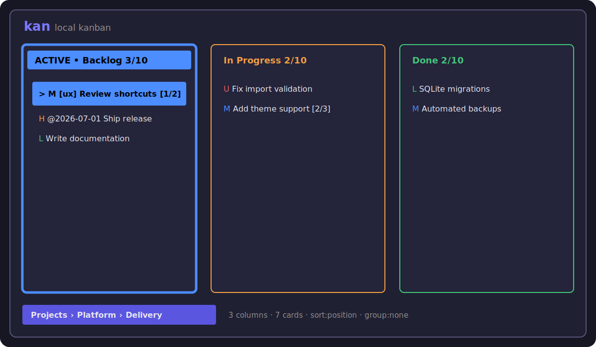

# kan

[](https://github.com/epoxsizer/kan/actions/workflows/ci.yml)
[](https://github.com/epoxsizer/kan/actions/workflows/release.yml)
[](LICENSE)

`kan` is a local-first task tracker with a terminal interface. It stores data in
SQLite and does not require a server, account, or network connection.

Data hierarchy:

```text
Project -> Board -> Column -> Card
```

The app includes full-text search, tags, priorities, due dates, comments,
checklists, custom fields, linked cards, JSON import/export, and automatic
backups. The database is local by default; backups can optionally be uploaded to
S3-compatible storage.

Current version: `0.1.2`.

## Interface



The interface adapts to terminal size. The active column and selected card are
highlighted, and contextual key hints are shown at the bottom of the screen.

## Quick Start From Source

Go 1.22 or newer is required.

```sh
git clone https://github.com/epoxsizer/kan.git
cd kan
make build
./bin/kan seed
./bin/kan
```

The `seed` command creates deterministic demo projects, boards, columns, and
cards. It is idempotent, so it can be run repeatedly without duplicating data.

To start with an empty database:

```sh
make build
./bin/kan migrate
./bin/kan
```

## Install A Release

Download the archive for Linux, macOS, or Windows from
[GitHub Releases](https://github.com/epoxsizer/kan/releases), verify it with
`checksums.txt`, and place the `kan` binary in a directory from your `PATH`.

You can also install with Go:

```sh
go install github.com/epoxsizer/kan/cmd/kan@latest
```

## Key Bindings

| Key | Action |
|---|---|
| `h j k l`, arrows | Navigate |
| `Enter`, `e` | Open or edit the selected object |
| `a` | Add a card or object on the current screen |
| `D` | Delete with confirmation |
| `d` | Show a short description popup |
| `H`, `L` | Move the selected card to the previous/next column |
| `Shift-Tab`, `Tab` | Move the selected card between columns |
| `J`, `K` | Reorder cards |
| `/` | Search within the current board |
| `:` | Command bar and global fuzzy search |
| `:layout table` | Show projects and boards as tables |
| `:layout cards` | Show projects and boards as card grids |
| `?` | Full help |
| `Esc` | Back or cancel |
| `q`, `Ctrl-C` | Quit |

In forms, use `Tab` to move between fields and `Ctrl-S` to save.

## CLI Commands

The app can be used without the TUI from shell scripts, CI jobs, and automation
agents. Successful data-management commands write JSON to standard output.
Names and titles containing spaces must be quoted in the shell.

```sh
kan project list
kan project create --name "New project" --comment "Project notes"
kan board list --project PROJECT_ID
kan board create --project PROJECT_ID --name "Development"
kan column create --board BOARD_ID --name "In Progress"
kan card create --board BOARD_ID --column COLUMN_ID --title "Prepare release"
kan card search --board BOARD_ID --query "release"
kan card update CARD_ID --priority high
kan card delete CARD_ID --yes
```

For the full command reference:

```sh
kan --help
kan card --help
kan card create --help
```

Do not run write commands at the same time as the TUI. The database lock protects
the SQLite database from concurrent writers.

## Import, Export, And Backups

```sh
kan backup
kan backup before-upgrade
kan export --out kan-export.json
kan import kan-export.json
```

Manual and automatic backups are stored in `backup/` relative to the current
working directory. While the TUI is running, an automatic backup is created about
every six hours.

Backup storage is local by default. To upload backups to S3 as well, configure
`backup.storage = "s3"` in `config.toml` or pass S3 flags to `kan backup`:

```toml
[backup]
storage = "s3"

[backup.s3]
bucket = "kan-backups"
prefix = "kan/backups"
region = "us-east-1"
endpoint = "https://s3.example.com"
access_key_id = "replace-me"
secret_access_key = "replace-me"
force_path_style = false
```

```sh
kan backup release \
  --storage s3 \
  --s3-bucket kan-backups \
  --s3-region us-east-1 \
  --s3-access-key-id "$S3_ACCESS_KEY_ID" \
  --s3-secret-access-key "$S3_SECRET_ACCESS_KEY"
```

`kan` always creates the local SQLite backup first and then uploads that file to
S3. The local database remains the source of truth.

## Data Paths

By default, `kan` uses XDG directories:

- config: `${XDG_CONFIG_HOME:-~/.config}/kan/config.toml`
- database: `${XDG_DATA_HOME:-~/.local/share}/kan/kan.db`
- log file: `${XDG_STATE_HOME:-~/.local/state}/kan/kan.log`

Paths can be overridden with `--config`, `--db`, `--log`, or with `KAN_CONFIG`,
`KAN_DB`, and `KAN_LOG`.

An example configuration file is available at
[`docs/config.example.toml`](docs/config.example.toml).

The theme section supports detailed color overrides for text, panels, selected
cards, status bars, help popups, command text, and columns. The selected column
uses green by default through `selected_column_background = "#42C77A"`.

## Development

```sh
make fmt         # format code
make test        # run tests
make check       # format check, go vet, tests, and build
make build       # build bin/kan
make cross-build # build Linux, macOS, and Windows binaries for amd64/arm64
```

Builds use `CGO_ENABLED=0` and a pure-Go SQLite driver.

The project is distributed under the [MIT License](LICENSE). Contribution rules
are in [CONTRIBUTING.md](CONTRIBUTING.md), and vulnerability reporting guidance
is in [SECURITY.md](SECURITY.md).
